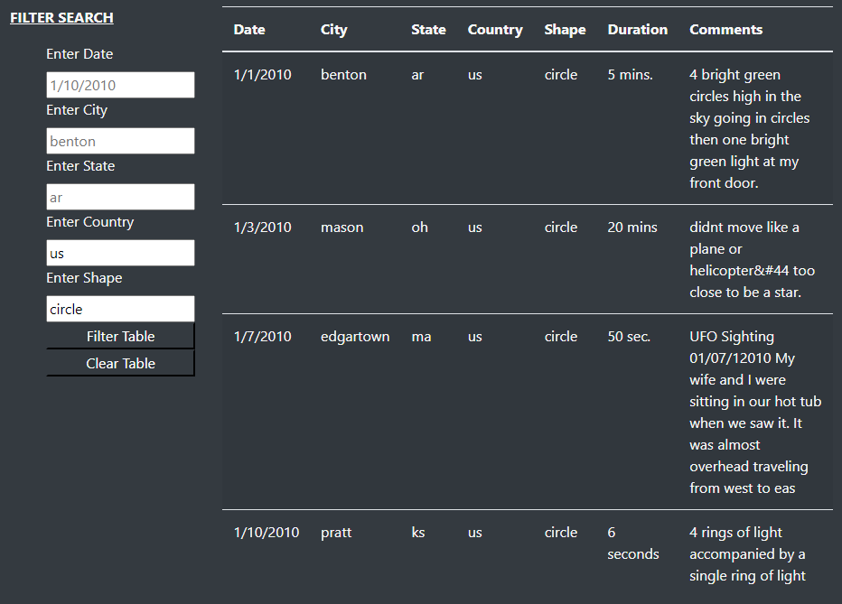

# Module 11 Challenge - UFOs
 
## Overview
The point of this analysis was to create a more in-depth analysis of UFO sightings on a webpage that would allow users to filter through multiple criteria.

## Results

You can use the table just by scrolling through it, or by filtering the table down with the filter search options on the left hand side as shown in the image above. In this case, we filtered for the country - US, and for the shape - circle, boiling it down to just 4 sightings. 

## Summary
One of the main drawbacks of the website to me is that you have to input the queries exactly into the filter boxes. 
 - One of the first things I would change is to immediately set some obvious connections to also search for the correct item such as "United States" and the "us", or even as simple as the capitalized version "US".
 - Similarly, another change I would make is to split up the year from the month, and the date so that you could search all the sightings that happened during a particular year or month. Right now, you can only enter an exact date to filter out, how would you know what date to search without knowing about the exact sighting beforehand?
 
 
